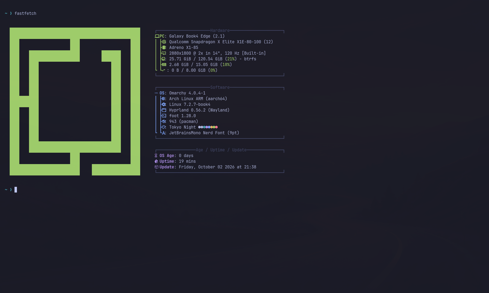

# Arch Linux ARM next to Fedora (toward Omarchy)

Status on 3 October 2026, 14" NP940XMA: **Omarchy 4.0.4 runs on Arch Linux
ARM** with the shared Anatase kernel. This is the working log for the Arch
side; [omarchy.md](omarchy.md) has the background and the two routes.

## Layout

- Same btrfs filesystem as Fedora (`sda5`), subvolume **`arch`** next to
  Fedora's `root`; separate `/home` inside each subvolume. No repartitioning.
- **Shared kernel**: Arch boots the Anatase kernel `7.2.7-book4` built and
  installed on Fedora (`/boot` is Fedora's ext4 partition), with the same
  default DTB (the camera DTB, see [camera.md](camera.md)).
- GRUB entry "Arch Linux (7.2.7-book4)" comes from the Fedora boot hook:
  `/etc/book4/second-os` on **Fedora** holds `arch Arch Linux`; the hook adds
  the entry when `/boot/initramfs-<kver>-arch.img` exists, with
  `rootflags=subvol=arch`.
- Arch's own kernel package (`linux-aarch64`) is removed. Kernel modules are a
  copy of Fedora's `/usr/lib/modules/7.2.7-book4`.
- Our firmware (Samsung DSP, GPU SQE, ath12k c5 set, topology alias) is in
  `/usr/lib/firmware/updates/` in Arch: searched first, never touched by pacman.

## How it was built (all from Fedora, in a container)

| Script | What |
|---|---|
| [`install/arch/stage1-base.sh`](../install/arch/stage1-base.sh) | subvolume, Arch Linux ARM tarball (signature checked by hand first), modules + firmware, locale/timezone, keyboard udev rule, mkinitcpio (UFS modules, no autodetect), pacman keys, fast mirrors (`dk`, `de4`), update, base packages, user with sudo, initramfs into Fedora's `/boot`, GRUB entry |
| [`install/arch/stage2-desktop.sh`](../install/arch/stage2-desktop.sh) | keyboard layout, Hyprland + Quickshell + uwsm + SDDM, PipeWire + our UCM profile, Bluetooth address service, `pipewire-libcamera`, Chromium, fonts, tray tools, starter `~/.config/hypr/hyprland.lua` |
| [`install/arch/sync-kernel.sh`](../install/arch/sync-kernel.sh) | from Fedora: a kernel installed there (modules, Arch initramfs, GRUB entry) given to Arch; see kernel updates below |
| [`install/arch/collect-logs.sh`](../install/arch/collect-logs.sh) | from Fedora: the last Arch boot's journal, SDDM and Hyprland logs to `~/arch-logs.txt` |

Lessons, in the order they bit:

1. GNU tar on Fedora drops `security.capability` xattrs from the Arch
   tarball; stage 1 reinstalls every package once to restore them (or use
   `bsdtar`).
2. In `systemd-nspawn`, Arch's `/etc/resolv.conf` is a symlink into `/run`:
   use `--resolv-conf=replace-uplink`.
3. `mirror.archlinuxarm.org` (geo-redirect) stalled on large files; `dk.` and
   `de4.mirror.archlinuxarm.org` were fast from here.
4. **Hyprland 0.56 uses a Lua config** (`/usr/share/hypr/hyprland.lua`,
   `~/.config/hypr/hyprland.lua`); there is no `hyprland.conf` example any more.
   Omarchy 4 is Lua too.
5. **`linux-firmware-qcom` is not part of Arch's default firmware set.**
   Without it `qcom/gen70500_gmu.bin` is missing, the Adreno does not come up
   (`MESA: get-param failed`, `failed to create dri2 screen`) and Hyprland
   aborts right after login, dropping back to SDDM.

## Omarchy (stage 3, on Arch itself)

| Script | What |
|---|---|
| [`install/arch/stage3-omarchy-build.sh`](../install/arch/stage3-omarchy-build.sh) | builds `omarchy`, `omarchy-settings` 4.0.4 and `omarchy-keyring` from Omarchy's own PKGBUILDs (`omacom/omarchy-pkgs`, pinned); lists which Omarchy default packages exist in Arch Linux ARM |
| [`install/arch/stage3-omarchy-install.sh`](../install/arch/stage3-omarchy-install.sh) | snapshot of the `arch` subvolume, pacman `NoExtract` guards, the packages, `mise-bin`, `omarchy-apply-system` with the unsafe steps skipped, checks |
| [`install/arch/stage3-omarchy-user.sh`](../install/arch/stage3-omarchy-user.sh) | moves the user onto Omarchy's configs (`/etc/skel`), scale and keyboard layout, `omarchy-provision-user` |
| [`install/arch/stage3-yay.sh`](../install/arch/stage3-yay.sh) | optional: `IgnorePkg` for the hand-installed packages, then `yay` built from the AUR |
| [`install/arch/stage3-chrome.sh`](../install/arch/stage3-chrome.sh) | optional: Google Chrome (aarch64) from Omarchy's aarch64 repo, then `omarchy-install-browser chrome` |

Each step was run on 3 October; the `mise` parts were added afterwards, so
`stage3-omarchy-install.sh` as a whole has not been run.

**Why the real packages and not a checkout.** Omarchy's PKGBUILDs already
build for aarch64 (the Apple Silicon path), and there they do **not** depend
on Limine, `limine-mkinitcpio-hook`, `limine-snapper-sync` or snapper. With
the packages, `omarchy-*` commands and `omarchy update` work as designed.
Stable v4.0.4 rather than the `quattro` branch (641 commits ahead, the
development line). Omarchy's aarch64 repository has no `omarchy`,
`omarchy-settings` or `omarchy-keyring`, so they are built locally.

What has to be kept out, and how:

| Omarchy piece | Problem here | Fix |
|---|---|---|
| `/etc/mkinitcpio.conf.d/omarchy_hooks.conf` | replaces our HOOKS (brings back `autodetect`, adds `plymouth`, `encrypt`); the next initramfs could not boot | `NoExtract` |
| `/etc/limine-entry-tool.d/*`, `thunderbolt_module.conf` | Limine / x86 only | `NoExtract` |
| `00-omarchy-update-guard.hook` | aborts plain `pacman -Syu` in favour of `omarchy update`, not yet checked here | `NoExtract` |
| `install/post-install/pacman.sh` | **overwrites `/etc/pacman.conf` and the mirrorlist** with Omarchy's (x86 mirrors, `[multilib]`): pacman breaks | skipped in a patched copy of the install tree |
| `install/config/snapper.sh` | snapper + `limine-snapper-sync` | skipped |
| `ufw-docker` in `firewall.sh` | not packaged for aarch64 | ufw rules kept, Docker part dropped |
| `omarchy-reinstall-configs` | runs `omarchy-refresh-limine` (writes `/boot/limine.conf`, `limine-update`) | never run it; stage 3c copies `/etc/skel` itself |
| `install/user/mise.sh` | run by `omarchy-refresh-applications`; writes `mise` stubs into `~/.local/bin`, one of them **over a native `claude`** | `NoExtract` + removed; `mise-bin` from Omarchy's aarch64 repo for the other stubs |

Other notes:

- 25 of Omarchy's 147 default packages are not in Arch Linux ARM: mostly
  Omarchy's own apps (`aether`, `omacalc`, `omacut`, `omawrite`, `tensaku`,
  `omarchy-nvim`), plus Obsidian, LocalSend, OBS, Pinta, `yay`, `tzupdate`,
  `ufw-docker`. Some are in `pkgs.omarchy.org/stable/aarch64` (`aether`,
  `mise-bin`, `google-chrome`); that repository is **not** added to
  pacman.conf because it also carries its own `hyprland`, which would replace
  Arch's. Packages taken from it are installed by URL with `pacman -U`
  (signature checked against the Omarchy key) and updated the same way.
- **Hand-installed packages are in `IgnorePkg`**: `omarchy`,
  `omarchy-settings`, `omarchy-keyring`, `mise-bin`, `google-chrome`. They are
  in no configured repository, so `yay` would treat them as AUR packages and
  try to replace them (AUR `google-chrome` is x86_64-only). Updating one by
  hand with `pacman -U` asks to install an ignored package anyway: yes.
- Omarchy's "Install" menu entries for AUR software go through `yay`
  (`omarchy-pkg-aur-add`); without `stage3-yay.sh` they fail. Many AUR
  packages have no aarch64 build.
- The default terminal in 4.0.4 is **foot** (`xdg-terminal-exec`).
- fastfetch shows the channel as "unknown": `omarchy-version-channel` looks
  for Omarchy's mirrors in pacman.conf and the mirrorlist, which we keep on
  Arch Linux ARM on purpose. Cosmetic.
- `omarchy-settings` replaces `/etc/os-release` (NAME=Omarchy), enables ufw
  (incoming denied except LocalSend), hands the power button to Omarchy and
  themes SDDM. All of it lives in the `arch` subvolume; Fedora is untouched.
- `/etc/skel` ships all migrations marked as done, so `omarchy update` does
  not replay the old ones.
- Hyprland 0.56 `hyprctl dispatch` takes Lua: log out with
  `hyprctl dispatch 'hl.dsp.exit()'`.
- Rollback: read-only snapshot `arch-pre-omarchy-<date>` at the top level of
  `sda5`, plus `~/pre-omarchy-home-<date>.tar.gz`.

Verified in the Omarchy session: Quickshell shell running, scale 2, Italian
layout (Omarchy adds compose on Caps Lock), Tokyo Night, no failed units,
`gh` login kept.

**Open:** a keyring password prompt when an app first touches the Secret
Service. Omarchy's `login/sddm.sh` removes the `pam_gnome_keyring` auth lines
from `/etc/pam.d/sddm`, so the `login` keyring (Chromium Safe Storage, `gh`
tokens) is no longer unlocked at login. Either give `login` an empty password
(Seahorse) or put the PAM lines back. Same symptom on Fedora with KWallet.

### Updating

`omarchy update` was read step by step on 3 October. It leaves the boot
setup alone: its package step is a plain `pacman -Syu` against Arch Linux ARM
(no kernel package is installed, so no initramfs and nothing in `/boot`),
`omarchy-snapshot` exits 127 without snapper (treated as "skip"), the Omarchy
key is already in pacman's keyring, and no migrations are pending. What it
needed here:

- **`yay`, with our packages ignored.** The hand-installed packages show up
  in `pacman -Qem`, so `omarchy-update-aur-pkgs` runs `yay -Sua`. Without
  `yay` the step fails and `set -e` stops the update after the system
  packages. `stage3-yay.sh` installs `yay` after putting those packages in
  `IgnorePkg`; `yay -Qua` then lists nothing.
- **The orphan step offered to remove `mkinitcpio`.** It was a dependency of
  `linux-aarch64`, which stage 1 removes. Fixed with
  `pacman -D --asexplicit mkinitcpio` (now in stage 1).
- **Omarchy itself never updates this way.** A new release means
  `stage3-omarchy-build.sh` with a newer pin, then reviewing the new
  migrations and the `NoExtract` list before installing.
- `omarchy-update-restart` looks for a package-owned
  `/usr/lib/modules/*/vmlinuz`; ours is a copied tree, so it would always
  offer "Linux kernel has been updated. Reboot?". Answer no unless a reboot
  is really due.

With `yay` and `mkinitcpio` fixed, `omarchy update` should run to the end;
**not yet run here**. Until it has been, `sudo pacman -Syu` (plus `yay -Sua`
and `mise up`) does the same job.

## What works (verified)

- Boot to a console, Wi-Fi via NetworkManager, internet.
- SDDM greeter.
- **Hyprland desktop** (3 October, after `linux-firmware-qcom`): eDP-1
  2880x1800 @ 120 Hz; scale **2.0** chosen over 1.6 and 1.8 (now the stage 2
  default).
- Italian keyboard (Hyprland and console), touchpad, touchscreen (Goodix
  `27c6:0123` as a touch device).
- Fn keys: volume, mute, mic mute, screen brightness, keyboard backlight.
- Speakers (left/right correct), internal microphones (signal recorded via
  `pw-record`).
- Bluetooth controller up with the address from Windows.
- Camera: `ov02c10` via libcamera, ~40 fps at 1920x1092, listed in PipeWire;
  privacy LED lit while streaming.
- Battery and AC in sysfs (`samsung-galaxybook-battery`).
- Suspend (s2idle) with the lid; Wi-Fi reconnects on resume.
- zram swap (3 October): 8 GB, zstd, like Fedora's default. Arch Linux ARM
  has no swap out of the box, and `omarchy-settings` leaves its zram drop-in
  out on aarch64. Set up by hand on the running system; now part of stage 2.

Not yet tested on Arch: headphones/headset mic, Bluetooth pairing, external
monitor.

Boot log: the CDSP's `fastrpc` and `qcom_smd_qrtr` channels fail to probe
("failed to create endpoint", -12) at the same instant as a `qcom-apm` "CMD
timeout for [1001021] opcode", 5 s after the ADSP's audio service registers.
Compared with Fedora's journal on 3 October: **not Arch-specific**.

| System, kernel | Boots | CDSP probe failures | APM timeout |
|---|---|---|---|
| Arch, 7.2.7-book4 | 5 | 2 every boot | every boot |
| Fedora, 7.2.7-book4 | 9 | 1 or 2 | every boot |
| Fedora, 7.2.0-61.fc45 | 1 | 2 | yes |

So it lives in the shared kernel/firmware stack (X1E remoteproc/glink and
Samsung's DSP firmware), not in the Arch setup or Anatase's patches. No
visible effect: audio goes through the ADSP, whose `fastrpc` probes fine; the
CDSP's `fastrpc` is only for compute offload. Tracked in [TODO.md](TODO.md).

## Where it stands / next steps

1. ~~Verify the desktop~~ done 3 October, see above.
2. ~~Omarchy's desktop~~ installed 3 October, see above. Still to check in
   the Omarchy session: launcher, menus, Fn keys under Omarchy's bindings,
   lock screen, suspend, battery in the bar; the keyring prompt.
   `omarchy update` read through and fixed up (see Updating); first real run
   still to do.
3. Compare with `bprendie/omarchy-snapdragon` (Omarchy 4.0.3 on Arch Linux ARM
   userspace with an Ubuntu kernel) for the aarch64 packaging they had to do.
4. Kernel updates: [`install/arch/sync-kernel.sh`](../install/arch/sync-kernel.sh)
   `<kver>`, run on Fedora after `install-anatase-kernel.sh` (which now prints
   the command). It copies `/usr/lib/modules/<kver>` into Arch, runs `depmod`
   and `mkinitcpio` in a container, refuses an initramfs without
   `ufs-qcom.ko`, installs it as `/boot/initramfs-<kver>-arch.img` (previous
   one kept as `.prev`) and reruns the boot hook. The Arch GRUB entry follows
   Fedora's **default** kernel and appears only when that kernel's `-arch`
   initramfs exists, so a new kernel needs the sync before it is pinned, or
   the Arch entry disappears until it is run. Written 3 October from Arch;
   not yet run.

## Rules that still apply in Arch

- Never write to or delete from the ESP (`/boot/efi`, shared with Windows);
  no bootloader packages (Limine, systemd-boot, grub installs) in Arch.
- `/boot` is Fedora's partition: Arch must not mount it as its own `/boot`
  for kernel packages.
- Never `modprobe -r ath12k` or rescan PCI. Keep `cutmem` and `cma=256M`
  (they live in Fedora's GRUB config).
